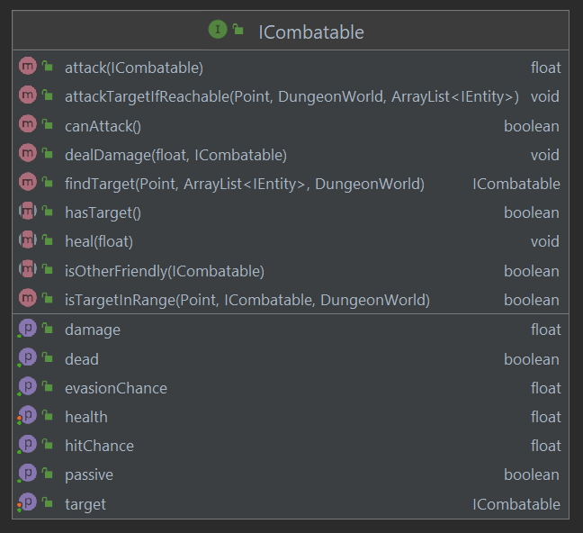

---
title:  'Lerntagebuch zur Bearbeitung von Blatt 01'
author:
- MALTE REINSCH (malte.reinsch1@fh-bielefeld.de)
- DENNIS ELLER (dennis.eller@fh-bielefeld.de)
- TIM LUECKING (tim.luecking2@fh-bielefeld.de)
...

<!--
Führen Sie zu jedem Aufgabenblatt und zum Projekt (Stationen 3-9) ein
Lerntagebuch in Ihrem Team. Kopieren Sie dazu diese Vorlage und füllen
Sie den Kopf entsprechend aus.

Im Lerntagebuch sollen Sie Ihr Vorgehen bei der Bearbeitung des jeweiligen
Aufgabenblattes vom ersten Schritt bis zur Abgabe der Lösung dokumentieren,
d.h. wie sind Sie die gestellte Aufgabe angegangen (und warum), was war
Ihr Plan und auf welche Probleme sind Sie bei der Umsetzung gestoßen und
wie haben Sie diese Probleme gelöst. Beachten Sie die vorgegebene Struktur.
Für jede Abgabe sollte ungefähr eine DIN-A4-Seite Text erstellt werden,
d.h. ca. 400 Wörter umfassen. Wer das Lerntagebuch nur ungenügend führt
oder es gar nicht mit abgibt, bekommt für die betreffende Abgabe 0 Punkte.

Checken Sie das Lerntagebuch mit in Ihr Projekt/Git-Repo ein.

Schreiben Sie den Text mit [Markdown](https://pandoc.org/MANUAL.html#pandocs-markdown).

Geben Sie das Lerntagebuch stets mit ab. Achtung: Wenn Sie Abbildungen
einbetten (etwa UML-Diagramme), denken Sie daran, diese auch abzugeben!

Beachten Sie auch die Hinweise im [Orga "Bewertung der Aufgaben"](pm_orga.html#punkte)
sowie [Praktikumsblatt "Lerntagebuch"](pm_praktikum.html#lerntagebuch).
-->

# Aufgabe

<!--
Bitte hier die zu lösende Aufgabe kurz in eigenen Worten beschreiben.
-->

tbd

Ein Teil der Aufgabe ist die Implementierung eines simplen Kampfsystems, welches
automatisch einsetzt, sobald sich ein Monster und der Held auf dem gleichen Feld
befinden. Der Kampf zwischen dem Monster und dem Helden soll parametrierbar sein,
sodass z.B. abhängig vom Gegner eine andere Trefferchance berechnnet wird.
Bei einem Treffer durch einen Gegner soll der Held ein Stück zurückgeschleudert
werden.

# Ansatz und Modellierung

<!--
Bitte hier den Lösungsansatz kurz beschreiben:
-   Wie sollte die Aufgabe gelöst werden?
-   Welche Techniken wollten Sie einsetzen?
-   Wie sah Ihre Modellierung aus (UML-Diagramm)?
-   Worauf müssen Sie konkret achten?
-->

tbd

Kampfsystem:
Jedes Monster und der Held müssen das Kampfsystem zu unterstützen. Um die
Codeduplikation möglichst minimal zu halten, wird daher ein gemeinsames Interface
definiert, welches die Basisfunktion des Kampfsystems beinhaltet.
Dieses Interface wird `ICombatable` genannt.
Im folgenden ist das UML-Diagramm des `ICombatable`-Interfaces abgebildet:

Die Kernmethode `attackTargetIfInRange` soll in der update-Methode der
implementierenden Klasse aufgerufen werden und automatisch nach potentiell
angreifbaren `ICombatable`-Instanzen nahe der eigenen Position suchen.

Wird ein angreifbares Ziel gefunden, wird es mit `setTarget` gecached, um in nachfolgenden
update-Zyklen nicht erneut nach Zielen suchen zu müssen. Falls sich das Ziel aus
dem Angriffsbereich hinausbewegt, wird das Ziel zurückgesetzt. Standardmäßig ist
dieser Bereich das aktuelle Feld, auf dem die `ICombatable`-Instanz steht.

In `attack` wird zusammen mit der eigenen `hitChance` und er
`evasionChance` der angegriffenen `ICombatable`-Instanz die Erfolgschance eines
Angriffs berechnet. Bei einem erfolgreichen Angriff wird der angegriffenen
`ICombatable`-Instanz mit `dealDamage` Gesundheit abgezogen. Falls die
Gesundheit eines `ICombatable` auf Null sinkt, stirbt es (dies kann über die
Methode `isDead` abgefragt werden).

# Umsetzung

<!--
Bitte hier die Umsetzung der Lösung kurz beschreiben:
-   Was haben Sie gemacht,
-   an welchem Datum haben sie es gemacht,
-   wie lange hat es gedauert,
-   was war das Ergebnis?
-->

tbd

Kampfsystem:
Zur Identifikation eines potentiellen Ziels für einen Angriff durch eine `ICombatable`-Instanz
wird zunächst der naive Ansatz gewählt, über alle `IEntity`-Instanzen im Spiel zu iterieren und die
erste Instanz zurückzugeben, welche ebenefalls eine Instanz von `ICombatable`
ist. Dies kann mit dem `instanceof`-Keyword überprüft werden. Falls die
`ICombatable`-Instanz zusätzlich das `IDrawable`-Interface implementiert, wird
über diese Interface die aktuelle Position des potentiellen Ziels ausgelesen.
Mit der `getTileAt`-Methode des `DungeonLevel`s wird ermittelt, ob das
potentielle Ziel auf dem gleichen Feld steht und somit angreifbar ist.
Dieser Ansatz setzt voraus, dass die `ICombatable`-Instanz eine Referenz auf die
`Game`-Instanz hält (um Zugriff auf die `IEntity`-Instanzen des
`EntityControllers` zu erlangen). Daher muss die `Actor`-Klasse eine Referenz auf
das `Game`-Objekt halten, welches um die Methode `getAllEntities` erweitert
wird.

Der Spielcharakter soll eine gewisse Distanz zurückgeschleudert werden, falls er
schaden erleidet. In der `dealDamage`-Implementierung der `Hero`-Klasse wird
durch die Position des Angreifers und einer definierten `knockBackDistance` der
Zielpunkt des Rückstoßes ermittelt. Da der Spielcharakter nicht einfach
innerhalb eines Frames an diese Position teleportiert werden soll, wird die
`update`-Methode des `Actor`s erweitert. Es wird zwischen zwei `MotionStates`
unterschieden (CAN_MOVE und IS_KNOCKED_BACK), ist der aktuelle `MotionState`
`CAN_MOVE`, kann der Spielcharakter wie gewohnt bewegt werde. Im Fall von
`IS_KNOCKED_BACK` wird in

20.04.2021: 17:00 - 20:00: Basisentwurf Kampfsystem gemeinsam erarbeiten.
21.04.2021: 17:00 - 20:00: Kampfsystem ausimplementieren und testen.

# Postmortem

<!--
Bitte blicken Sie auf die Aufgabe, Ihren Lösungsansatz und die Umsetzung
kritisch zurück:
-   Was hat funktioniert, was nicht? Würden Sie noch einmal so vorgehen?
-   Welche Probleme sind bei der Umsetzung Ihres Lösungsansatzes aufgetreten?
-   Wie haben Sie die Probleme letztlich gelöst?
-->

tbd

Der naive Ansatz, zur Erkennung von angreifbaren `IEntity`-Instanzen über alle
im Level befindlichen `IEntity`-Instanzen zu iterieren hat noch
Optimierungsbedarf. Dies ist insbesondere der Fall, da jede
`ICombatable`-Instanz diese Iteration durchführt. Daher darf der aktuelle
Zustand des Kampfsystems nur als erster Startpunkt betrachtet werden. Eine
effizientere Lösung wäre beispielsweise eine
[spatial hashmap](https://www.gamedev.net/articles/programming/general-and-gameplay-programming/spatial-hashing-r2697/).
mit der gehashten Koordinaten eines Feldes als Schlüsselwert und den `IEntity`-Instanzen auf
diesem Feld als Wert. So müsste nur am Anfang jedes Frames einmal über alle
`IEntity`-Instanzen iteriert werden, um die Hashmap mit den aktuellen Position
der Instanzen zu aktualisieren. Mit solche einer Hashmap könnte eine
`ICombatable`-Instanz genau die Felder nach potentiellen Zielen durchsuchen, die
auch in dem möglichen Angriffsradius liegen. Aus zeitlichen Gründen wird diese
Umsetzung allerdings auf einen späteren Zeitpunkt verschoben.
