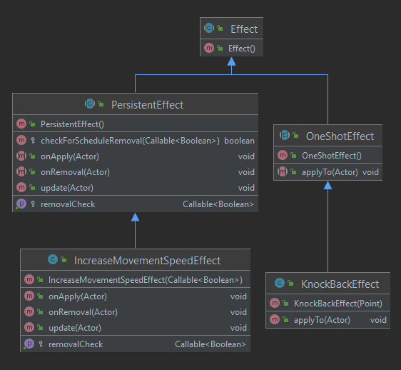

---
title:  'Lerntagebuch zur Bearbeitung von Blatt 04' author:

- MALTE REINSCH (malte.reinsch1@fh-bielefeld.de)
- DENNIS ELLER (dennis.eller@fh-bielefeld.de)
- TIM LUECKING (tim.luecking2@fh-bielefeld.de)
  ...

<!--
Führen Sie zu jedem Aufgabenblatt und zum Projekt (Stationen 3-9) ein
Lerntagebuch in Ihrem Team. Kopieren Sie dazu diese Vorlage und füllen
Sie den Kopf entsprechend aus.

Im Lerntagebuch sollen Sie Ihr Vorgehen bei der Bearbeitung des jeweiligen
Aufgabenblattes vom ersten Schritt bis zur Abgabe der Lösung dokumentieren,
d.h. wie sind Sie die gestellte Aufgabe angegangen (und warum), was war
Ihr Plan und auf welche Probleme sind Sie bei der Umsetzung gestoßen und
wie haben Sie diese Probleme gelöst. Beachten Sie die vorgegebene Struktur.
Für jede Abgabe sollte ungefähr eine DIN-A4-Seite Text erstellt werden,
d.h. ca. 400 Wörter umfassen. Wer das Lerntagebuch nur ungenügend führt
oder es gar nicht mit abgibt, bekommt für die betreffende Abgabe 0 Punkte.

Checken Sie das Lerntagebuch mit in Ihr Projekt/Git-Repo ein.

Schreiben Sie den Text mit [Markdown](https://pandoc.org/MANUAL.html#pandocs-markdown).

Geben Sie das Lerntagebuch stets mit ab. Achtung: Wenn Sie Abbildungen
einbetten (etwa UML-Diagramme), denken Sie daran, diese auch abzugeben!

Beachten Sie auch die Hinweise im [Orga "Bewertung der Aufgaben"](pm_orga.html#punkte)
sowie [Praktikumsblatt "Lerntagebuch"](pm_praktikum.html#lerntagebuch).
-->

# Aufgabe

<!--
Bitte hier die zu lösende Aufgabe kurz in eigenen Worten beschreiben.
-->

## HUD

Im ersten Teil des Praktikums soll ein HUD (heads-up display) implementiert werden. Das HUD soll das Leben und das Level
des Helden dauerhaft anzeigen. Zusätzlich soll das Inventar des Helden dargestellt werden. Das Inventar von Kisten soll
angezeigt werden, sofern eins geöffnet ist.

## Erfahrung und Skills

Es soll außerdem ein Erfahrungssystem implementiert werden, sodass der Held Erfahrung durch das Besiegen von Monstern
erhält und so stärker wird. Darüber hinaus soll der Held neue Fähigkeiten beim Stufenaufstieg erhalten.

## Fallen

Der letzte Teil des Praktikums war die Implementierung von Fallen. Dabei sollen Fallen durch Gegenstände, Monster oder
durch den Helden ausgelöst werden. Die Fallen sollen zum Beispiel Schadenspunkte verteilen, den Auslöser teleportieren
oder zufällige Monster herbeizaubern. Dabei können Fallen sichtbar oder versteckt sein. Versteckte Fallen sollen über
einen Zaubertrank oder Zauberspruch sichtbar gemacht werden können. Des Weiteren sollen Fallen entweder einmal oder
mehrmals aktiviert werden können.

# Ansatz und Modellierung

<!--
Bitte hier den Lösungsansatz kurz beschreiben:
-   Wie sollte die Aufgabe gelöst werden?
-   Welche Techniken wollten Sie einsetzen?
-   Wie sah Ihre Modellierung aus (UML-Diagramm)?
-   Worauf müssen Sie konkret achten?
-->

## HUD

Das Leben des Helden soll in Form von zehn Herzen angezeigt werden. Verliert der Held Leben, werden statt volle Herzen,
halbvolle bzw. leere Herzen angezeigt. Wenn sich das maximale Leben des Helden erhöht, soll sich die Anzeige verändern.
Dann wird ein volles Herz mit einer Zahl angezeigt. Die Zahl entspricht der Anzahl an Herzen.

Das Level des Helden wird in Textform dargestellt. Dazu wird das Level, die aktuellen Erfahrungspunkte und die
notwendigen Erfahrungpunkte für einen Level-Aufstieg angezeigt.

Das Inventar des Helden wird dauerhaft angezeigt. Aufgesammelte Gegenstände werden direkt im Inventar dargestellt. Wenn
das Inventar geöffnet wird, soll mit Hilfe eines Zeigers die aktuelle Position im Inventar makiert werden. Gegenstände,
die der Held in den Händen hält, werden seperat in zwei weiteren Slots angezeigt. Das Inventar einer Kiste verhält sich
identisch zu dem des Helden, wird aber nur dann angezeigt, wenn eine Kiste geöffnet ist.

Damit nicht zyklisch auf eine Änderung getestet werden muss, werden Observer-Pattern zur Umsetzung verwendet. Nur wenn
sich Informationen ändern, verändert sich das HUD. Dabei muss beachtet werden, wann genau die Observer benachrichtigt
werden.

## Erfahrung und Fähigkeiten ##

Die Logik für das Ansammeln von Erfahrungspunkten und den Stufenaufstieg wird in der Klasse `Level` vorgesehen. Diese
Klasse kapselt die Berechnungen der Erfahrungspunkte, welche zum Aufstieg auf die nächste Stufe nötig sind. Als
Belohnung für einen Stufenaufstieg soll der Held bei jedem Stufenaufstieg mehr Gesundheit erhalten und erhöhten
Basisschaden verursachen können. Die Berechnung dieser Boni ist ebenfalls in der `Level`-Klasse vorgesehen.

Im folgenden ist das UML-Diagramm der `Level`-Klasse abgebildet:

Das Level implementiert zusätzlich das `ObservableLevel`-Interface, um das HUD bei Veränderung der aktuellen
Erfahrungspunkte oder eines Stufenaufstiegs zu benachrichtigen.

Fähigkeiten sollen sowohl den Helden selbst, als auch andere Actor-Instanzen
(z.B. Monster) beeinflussen können. Daher basiert das Fähigkeitensystem auf der `Ability`-Klasse, welche bestimmt, wie
eine bestimmte Fähigkeit Instanzen der `Effect`-Klasse auf `Actor`-Instanzen anwendet. Ein Effekt ist beispielsweise die
Senkung eines Statusattributs oder das Initiieren eines bestimmten Verhaltens. Hierbei wird zwischen peristenten
Effekten (die über eine längere Dauer angewandt werden) und einmalig angewandten Effekten unterschieden.

Im folgenden sind die UML-Diagramme für die `Ability`- und `Effect`-Klassen abgebildet:

Durch die Kapselung der Fähigkeiten und Effekte auf diese Weise können Fähigkeiten und Effekte einen eigenen Zustand
haben, um beispielsweise zeitlich begrenzte Effekte zu realisieren.

## Fallen

Als Fallen sollen folgende Arten implementiert werden:

- HoleTrap: Ein Loch in das ein Actor fallen kann und stirbt.
- SpikeTrap: Stacheln die kontinuierlich ein- und ausfahren. Ist unsichtbar, bis sie durch einen Zauberspruch sichtbar
  gemacht werden.
- TeleportTrap: Teleportiert einen Actor an eine zufällige Stelle im Dungeon.
- ActivatorTrap: Wenn ein Gegenstand auf ihr abgelegt wird, werden drei zufällige Monster gespwant.

Da es verschiedene Fallenarten gibt, werden die Fallen über die TrapFactory erzeugt. Dadurch wird das Erstellen von
Fallen vereinfacht. Damit es (wie bei der Verwendung eines Strings) zu keinen Tippfehlern kommen kann, wird ein TrapType
Enum definiert, welches alle möglichen Fallenarten definiert. Dabei enthält LevelContent Informationen über ein
spezifisches Level (Monster, Item, Kisten etc.) während LevelInfo die Informationen über alle Level hält und dem
GameController zur Verfügung stellt. Die entsprechenden Trap Klassen sind in folgender Abbildung dargestellt.

# Umsetzung

<!--
Bitte hier die Umsetzung der Lösung kurz beschreiben:
-   Was haben Sie gemacht,
-   an welchem Datum haben sie es gemacht,
-   wie lange hat es gedauert,
-   was war das Ergebnis?
-->

## HUD

Zu Beginn mussten alle notwenigen HUD-Objekte implementiert werden. Dazu wurden Klassen erzeugt, die neben den
notwendigen Methoden zum Zurückgeben von Textur und Position, Methoden zum Ändern der Textur besitzen. Beim Start werden
alle Objekte dem HUD hinzugefügt und im Laufe des Spiels lediglich die Texturen geändert. So können verschiedene Herz-
und Itemtexturen verwendet werden. Wenn keine Kiste geöffnet ist, werden die zuständigen Texturen durchsichtig
geschaltet. Damit nicht jeden Zyklus Daten vom Inventar und Helden abgefragt werden müssen, werden verschiedene Observer
verwendet. Zusätzlich wird die Anzeige der Herzen abhängig von der Anzahl der aktuellen Herzen berechnet. Wie oben
beschrieben, wird die Anzahl an Herzen als Zahl dargestellt, falls ein Wert von mehr als zehn Herzen erreicht ist.

07.05.2021 15:00 - 20:00 Erste Version des HUDs mit Herzen und Grundlagen des Inventars 08.05.2021 11:00 - 21:00
Verbessern der Herzenanzeige, Hinzufügen von Levelanzeige, Hinzufügen von Hintergrund von Inventaren, Hinzufügen von
Pointer auf ausgewähltes Inventarobjekt 09.05.2021 11:00 - 15:00 JavaDoc und letzte Bugfixes.

## Erfahung und Fähigkeiten ##

Die Berechnung der für einen Stufenaufstieg benoetigten Erfahrungpunkte erfolgt nach der Formel $n_{Erfahrungspunkte}
= (level * c_{xp})^2$, wobei $c_{xp}$ eine Konstante ist, die bestimmt, wie stark die Funktion ansteigt. Diese Formel
wurde gewählt, damit die Anzahl der benötigten Erfahrungspunkte in Abhängigkeit des Levels zunimmt. Für das Wachstum der
Boni auf Gesundheit und Schaden wird eine lineare Charakteristik gewählt, da der Held sonst mitunter sehr schnell zu
stark für die aktuell implementierten Gegner ist. Die Anpassung solcher Wachstumscharakteristika kann sehr viel Zeit in
Anspruch nehmen, daher werden die beschriebenen Kurven als erster Iterationsschritt betrachtet.

Es sind aktuell zwei Fähigkeiten implementiert. Die "Sprint"-Fähigkeit erhöht die Bewegungsgeschwindigkeit des Helden um
einen bestimmten Faktor. Die
"KnockBack"-Fähigkeit stößt Gegner in einem bestimmten Radius zurück. Diese Fähigkeiten können durch Tastendrücke
aktiviert werden. Um jedoch nicht in der
`Ablity`-Subklasse fest die Taste zu kodieren, kann dem `Ability`-Konstruktor ein `Callable<Boolean>`-Objekt übergeben
werden, welches in der `update`-Methode der `Hero`-Klasse aufgerufen wird, um zu überprüfen, ob eine bestimmte Fähigkeit
aktiviert werden soll. Aktuell wird bspw. für die "Sprint"-Fähigkeit eine Lambda-Funktion für diesen Parameter
übergeben, welche überprüft, ob die linke
"Shift"-Taste gedrückt wird. Prinzipiell kann hier jedoch jede Funktion verwendet werden, die einen booleschen Wert
zurückgibt. Ein ähnliches Vorgehen wird für die Überprüfung, ob persistenten Effekte aus dem `Actor` entfernt werden
sollen, genutzt.

- 06.05.2021 17:00 - 20:00 Konzeptionierung und Implementierung des Erfahrungssystems
- 07.05.2021 15:00 - 20:00 Konzeptionierung und Implementierung des Fähigkeitensystems
- 08.05.2021 15:00 - 20:00 Bugfixing, Refactoring, Lerntagebuxh ausfüllen
- 09.05.2021 11:00 - 15:00 Letzte Bugfixes, Javadoc, Lerntagebuch finalisieren

## Fallen

Durch die immer größer werdene Anzahl an Entitätsarten wurde ein Spawner implementiert, der alle Factory-Objekte
zusammenfasst und dem GameController zur Verfügung stellt. Des Weiteren werden die Informationen über die Level über die
Klassen LevelInfo und LevelContent erstellt. Die SpikeTrap wurde mit einer Statemachine implementiert, die über
SpikesTrapState die Zustände wechselt. Dabei teilt die SpikesTrap bei jeder Aufwärtsbewegung der Stacheln (sobald diese
über der Oberfläche sind) Schaden an alle Actor Instanzen aus, die auf der Falle stehen. SpikeTraps sind für den Helden
nicht sichtbar. Erst wenn eine SupervisionScroll verwendet wird, kann die Falle im Level gesehen werden. Die HoleTrap
tötet jede Entity die in das Loch hinein gerät. Läuft ein Actor in das Loch stirbt er.
(Game Over). Die ActivatorTrap spawnt drei zufällige Monster, wenn ein Gegenstand auf sie abgelegt wird. Die
TeleporterTrap teleportiert den Actor an eine zufällige Stelle im Dungeon.

07.05.2021 12:00 – 22:00 Erste Version Fallen, Spawner 08.05.2021 8:00 – 20:00 Factories für alle Entities erstellt,
ActivatorTrap, Anpassungen der Skalierungen 09.05.2021 9:00 - 15:00 JavaDoc und letzte Bugfixes.

# Postmortem

<!--
Bitte blicken Sie auf die Aufgabe, Ihren Lösungsansatz und die Umsetzung
kritisch zurück:
-   Was hat funktioniert, was nicht? Würden Sie noch einmal so vorgehen?
-   Welche Probleme sind bei der Umsetzung Ihres Lösungsansatzes aufgetreten?
-   Wie haben Sie die Probleme letztlich gelöst?
-->

## HUD

Das Verwenden von Observern sparrt Rechenzeit, da nicht jeden Zyklus Informationen abgefragt werden müssen. Dies hat gut
funktioniert und ermöglicht das effiziente Steuern des HUD. Da viele Programmteile fürs HUD wichtige Informationen
bereitstellen, müssen mehrere Observer implementiert werden. Diese besitzen nahezu identischen Code.

## Erfahrung und Fähigkeiten

Die `Actor`-Klasse verwendet die Methoden `schedulePersistentEffectForRemoval`, um persistente Effekte aus der Liste der
aktiven Effekte zu löschen. Hierfür kann ein peristenter Effekt sich selbst in eine Liste für zu entfernende Effekte
eintragen. Für Effekte, welche in Abhängigkeit eines bestimmten Tastendrucks entfert werden sollen, traten selten Fälle
auf, in denen Effekte mehrfach entfernt wurden. Dies führte meistens zu einer `IndexOutOfBoundsException`. Um dieses
Problem zu lösen wird überprüft, ob ein Effekt, welcher sich für die Entfernung einträgt, bereits in der dafür
vorgesehenen Liste eingetragen ist.

## Fallen

Das Verwenden einer Basisklasse vereinfacht die Implementierung der Fallen erheblich. Bei der Implementierung erwies es
sich problematisch, dass noch kein Verständnis dafür vorlag, wie der Offset von der Engine verarbeitet wird, was zu viel
Rumprobieren geführt und viel Zeit gekostet hat. Des Weiteren war es problematisch zu überprüfen, ob ein Actor bereits
von einer Falle getroffen wurde. Um das zu Lösen werden Schadenspunkte nur beim Zustandswechsel der Falle abgezogen.
