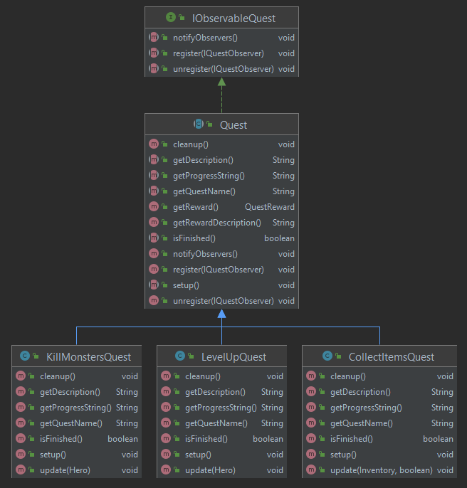
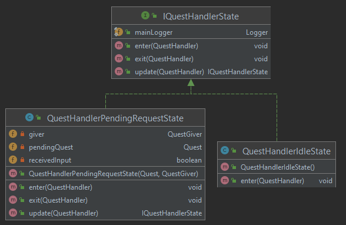

---
title:  'Lerntagebuch zur Bearbeitung von Blatt 04'
author:
- MALTE REINSCH (malte.reinsch1@fh-bielefeld.de)
- DENNIS ELLER (dennis.eller@fh-bielefeld.de)
- TIM LUECKING (tim.luecking2@fh-bielefeld.de)
  ...

<!--
Führen Sie zu jedem Aufgabenblatt und zum Projekt (Stationen 3-9) ein
Lerntagebuch in Ihrem Team. Kopieren Sie dazu diese Vorlage und füllen
Sie den Kopf entsprechend aus.

Im Lerntagebuch sollen Sie Ihr Vorgehen bei der Bearbeitung des jeweiligen
Aufgabenblattes vom ersten Schritt bis zur Abgabe der Lösung dokumentieren,
d.h. wie sind Sie die gestellte Aufgabe angegangen (und warum), was war
Ihr Plan und auf welche Probleme sind Sie bei der Umsetzung gestoßen und
wie haben Sie diese Probleme gelöst. Beachten Sie die vorgegebene Struktur.
Für jede Abgabe sollte ungefähr eine DIN-A4-Seite Text erstellt werden,
d.h. ca. 400 Wörter umfassen. Wer das Lerntagebuch nur ungenügend führt
oder es gar nicht mit abgibt, bekommt für die betreffende Abgabe 0 Punkte.

Checken Sie das Lerntagebuch mit in Ihr Projekt/Git-Repo ein.

Schreiben Sie den Text mit [Markdown](https://pandoc.org/MANUAL.html#pandocs-markdown).

Geben Sie das Lerntagebuch stets mit ab. Achtung: Wenn Sie Abbildungen
einbetten (etwa UML-Diagramme), denken Sie daran, diese auch abzugeben!

Beachten Sie auch die Hinweise im [Orga "Bewertung der Aufgaben"](pm_orga.html#punkte)
sowie [Praktikumsblatt "Lerntagebuch"](pm_praktikum.html#lerntagebuch).
-->

# Aufgabe

<!--
Bitte hier die zu lösende Aufgabe kurz in eigenen Worten beschreiben.
-->

## Quests
Es soll ein Questsystem implementiert werden. Verschiedene Quests sollen
vom Helden annehmbar sein und nach Abschluss den Helden entlohnen. Die Entlohnung
soll die Form von Items und Erfahrungspunkten haben. Ein Geist soll beispielsweise
eine Quest vorschlagen, welche vom Helden angenommen oder abgelehnt werden kann. Questinformationen
sollen vor dem Auswählen auf dem HUD angezeigt werden. Wenn die Quest angenommen wurde, soll
der Fortschritt der aktuellen Quest ebenfalls auf dem HUD angezeigt werden. Mindestens eine
Quest soll dabei kampfunabhängig sein.

## jUnit
Für die Quests sollen systematisch geeignete Testfälle entwickelt werden.

# Ansatz und Modellierung

<!--
Bitte hier den Lösungsansatz kurz beschreiben:
-   Wie sollte die Aufgabe gelöst werden?
-   Welche Techniken wollten Sie einsetzen?
-   Wie sah Ihre Modellierung aus (UML-Diagramm)?
-   Worauf müssen Sie konkret achten?
-->

## Quests

Es werden drei Quests implementiert. Eine Quest befasst sich mit dem Einsammeln von Items, eine
weitere mit dem Töten einer bestimmten Anzahl an Gegnern und die letzte mit dem Aufsteigen des
Erfahrungslevels. Dazu wird eine abstrakte Klasse `Quest` implementiert, von der jede spezifische
Questklasse erbt. Das UML-Diagramm für die Quests ist in folgender Abbildung dargestellt.

Um den Fortschritt der Quests aktualisieren zu können, wird das Observer-Pattern
verwendet. Nur bei Änderungen wichtiger Parameter (wie beispielsweise das Aufheben von Items oder das
Töten eines Gegners) wird der Fortschritt angepasst.

Die Klasse `QuestHandler` ist für die Speicherung und Überwachung der aktuellen
Quest zuständig. Die Klasse regelt das Aktivieren einer neuen `Quest`. Dazu wird
eine bestimmte Tastatureingabe erwartet. Wenn eine neue Quest angenommen wird,
wird die alte Quest überschrieben. Zusätzlich ist der `QuestHandler` für die
Übertragung der jeweiligen Questbelohnungen an den `Hero` zuständig. Intern
wird eine Statemachine implementiert, um beispielsweise das Abfragen der
Tastatureingabe in Zustände auszulagern und vom `QuestHandler` zu isolieren. Die
Statemachine ist in folgender Abbildung dargestellt.

Die Klasse `QuestGiver` implementiert `IDrawable` und `IEntity`.  Pro Level wird
ein `QuestGiver` mit einer zufälligen Quest initialisiert und gespawnt. Der
`QuestGiver` überprüft, ob sich der Held auf dem gleichen `Tile` befindet,
und schlägt ihm in diesem Fall die Quest vor. Dazu wird dem `QuestHandler` eine Anfrage
gestellt, die Quest zu starten. Wird das `Tile` des `QuestGivers` verlassen,
wird die Anfrage an den `QuestHandlers` abgebrochen.

Das HUD registriert sich am `QuestHandler` (Observer-Pattern). Bei Updates wird
das HUD benachrichtigt. Beim Vorstellen einer Quest erscheint die Beschreibung
der Quest und die Belohnung. Die erwarteten Tasten zum Annehmen oder Ablehnen
der Quest werden angezeigt. Wenn eine Quest durch den Nutzer angenommen wird, erscheint eine
Statusanzeige im rechten, oberen Bereich des Fensters. Beim erfolgreichen
Abschließen einer Quest wird dies angezeigt und die Farbe der Statusanzeige auf
grün geändert.

## jUnit

Es werden Tests für alle Quests erstellt. Dazu müssen vorerst Mockups von
bestimmten Klassen implementiert werden. Um die Quests zum Testen
initialisieren zu können, wird je ein Object der Klasse `Hero`, `ICombatable` und
`Item` benötigt. Die Mockups überschreiben bestimmte Funktionen wie
beispielsweise die Erstellung einer Animation, um die Abhängigkeit von
Texturen aus dem `assets`-Ordner aufzulösen.

Zusätzlich wird den Quests ein weiterer Konstruktor hinzugefügt. Der
Standard-Konstruktor erzeugt eine zufällige Menge an Items. Dem neuen
Konstruktor zum Testen kann man eine Liste an `MockItems` übergeben. So wird die
Testbarkeit der Quest-Klassen erhöht.

# Umsetzung

<!--
Bitte hier die Umsetzung der Lösung kurz beschreiben:
-   Was haben Sie gemacht,
-   an welchem Datum haben sie es gemacht,
-   wie lange hat es gedauert,
-   was war das Ergebnis?
-->

## Quests

13.05.2021 15:00 - 18:00	Erste Implementierung des Questgivers
13.05.2021 15:00 - 19:00	Erste Implementierung des Questhandlers und Hinzufügen einer ersten Quest
13.05.2021 15:00 - 17:00	Erste Implementierung der Anzeige der Quests auf dem HUD

14.05.2021 15:00 - 17:00	Anpassen des Questgivers
14.05.2021 17:00 - 19:00    Verknüpfung des Questgivers und des QuestHandlers

15.05.2021 19:00 - 20:00	Zusammenführung von HUD und QuestHandler
15.05.2021 12:00 - 15:00	Lerntagebuch

## jUnit

16.05.2021 10:00 - 13:00	Implementierung von Testfällen für Quests

# Postmortem
<!--
Bitte blicken Sie auf die Aufgabe, Ihren Lösungsansatz und die Umsetzung
kritisch zurück:
-   Was hat funktioniert, was nicht? Würden Sie noch einmal so vorgehen?
-   Welche Probleme sind bei der Umsetzung Ihres Lösungsansatzes aufgetreten?
-   Wie haben Sie die Probleme letztlich gelöst?
-->

Durch den Aufbau des Questgivers und des Questhandlers können weitere Quests einfach erstellt werden.

Die Statemachine im Questhandler ermöglicht eine saubere Abbildung der möglichen Zustände und vereinfacht
so die Programmierung.

Das Verwenden vom Observer-Pattern ermöglicht eine Programmierung ohne Polling
und reduziert die Rechenzeit pro Update-Zyklus.
Die Quests registrieren sich als Observer in einigen Klassen. Wird bei einem
Update der Quest die Bedingung zur Erfüllung der Quest erfüllt, so ruft der
QuestHandler die `cleanup`-Methode der Quest auf. In dieser Methode hebt die
Quest ihre Registrierung bei den Observables auf. Dies führt zu einer `ConcurrentModificationException`,
da durch die Aufhebung der Registrierung die Liste der Observern, über welche
aktuell iteriert wird, modifiziert wird.
Um dieses Problem zu lösen, werden die `unregister`-Methoden der Observables,
in denen sich die Quests registrieren, angepasst. So wird der Observer nicht
mehr direkt aus der `registeredObservers` Liste gelöscht, sondern in einer
temporären Liste gespeichert. Die Observer aus dieser Liste werden im nächsten
`update`-Zyklus aus der `registeredObservers` Liste gelöscht. In der
`notifyObservers`-Methode wird zusätzlich überprüft, ob ein Observer bereits in
der temporären Liste ist und wird in diesem Fall nicht mehr über
Zustandsänderungen benachrichtigt.
